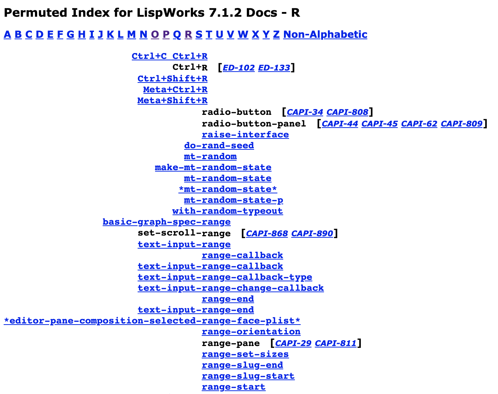

LW-DOC
======

This is a quick hack to create a permuted index (similar to the one
found in the CLHS) for (parts of) the LispWorks documentation.
Exported symbols and editor commands are assembled from the
documentation's index pages using simple regular expressions.

The application was developed and tested using LispWorks 4.4.5 pro
through 6.0.0 pro on Windows and (sometimes) Linux.  No attempt has
been made to ensure that it works with other versions of LispWorks.

Requirements: ASDF, CL-PPCRE, CL-WHO.  (Google if you don't know them.)

Here is how a typical index page looks like:



Installation
------------

This library is available from this LispWorks quicklisp distribution:
https://ultralisp.org/dists/lispworks

Install it from the REPL, like this:

```
(ql-dist:install-dist "http://dist.ultralisp.org/lispworks.txt"
                      :prompt nil)
```

Then just use `(ql:quickload :lw-doc)`.

Usage
-----


```lisp
(lw-doc:create-permuted-index)
```

See the documentation string of this function for more options.

On OSX it is unable to create index because by default
the path will be inside
`/Applications/LispWorks 7.1 (64-bit)/Library/lib/7-1-0-0/manual/online/`,
but it is read-only.

In this case, you can specify an alternative parent directory:

```lisp
(lw-doc:create-permuted-index :target-dir #P"/tmp/index/"
                              :link-prefix "http://www.lispworks.com/documentation/lw71/")
```
